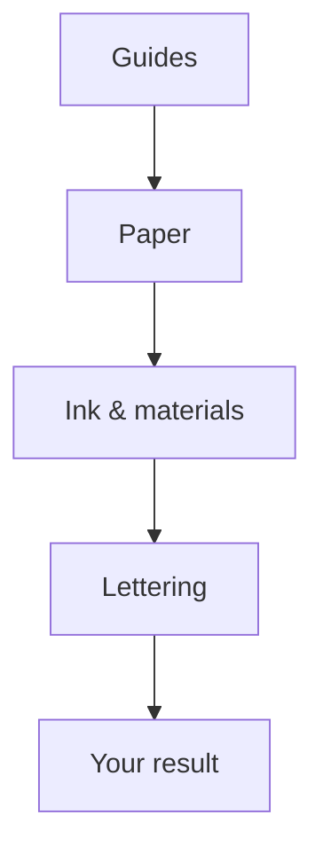
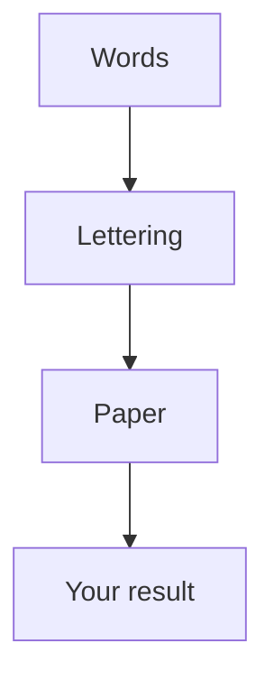
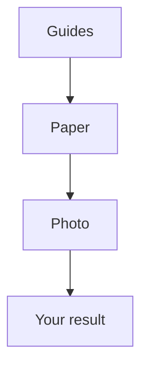
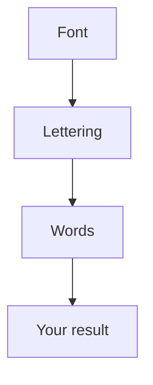
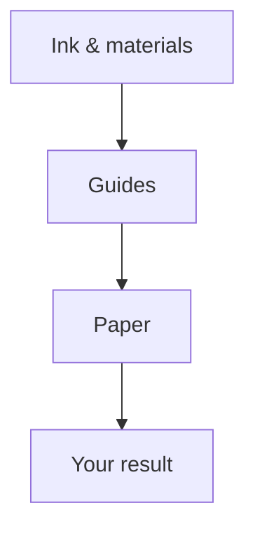
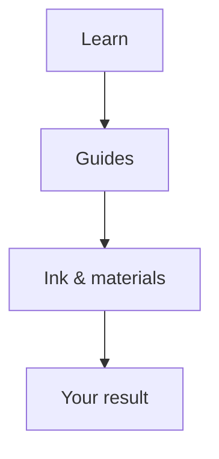
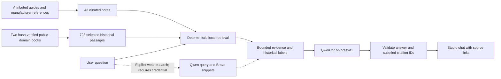
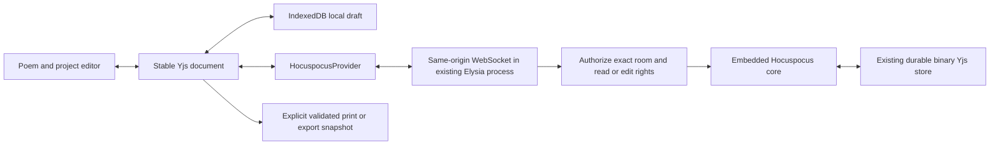

# Calligraphy studio paths

These diagrams describe the implemented local studio. They do not imply a production deployment. **Wizard quiz mode** starts with six purposes; **Workflow** lets a writer inspect a React Flow route, open its tools, or choose **Follow this path**. Each route can export Mermaid directly from the same metadata that drives the wizard.

Selecting a path changes navigation only. Editing controls still use the existing draft and autosave. Only the active question mounts; source photo and poem data stay in the draft, while transient tool selections can restart when revisiting a step. The requirements assistant remains available below every path, with explicit proposal review, Apply and Undo. Font service availability is shown by its real capability response; this route does not promise a complete automatic alphabet or font compiler.

## Make a practice sheet

Set guides, paper, tools and example lettering for a printable session.

## Lay out a poem or excerpt

Edit the words, choose their lettering and fit the composition to paper.

## Match lettering from a photo

Measure a sample, translate its proportions into guides and check the page.

## Create a font from an alphabet

Prepare a sample, review available letter tools, then finish and import a font.

## Plan an ink and paper test

Choose a useful test layout, record materials and print a comparison sheet.

## Learn a calligraphy skill

Start with a guide, select a focused exercise and leave with a practice page.

## Knowledge to Qwen

The browser library exposes 43 concise sourced notes and two complete downloadable public-domain texts. The server also retrieves from 728 indexed passages in selected instructional chapters and lessons. Historical chemical/tool recipes are excluded from this retrieval corpus; the complete downloaded books are retained unchanged with their source licenses. The corpus ships only in the server bundle, not the browser JavaScript.

Formula-only settings remain available without AI. A model can suggest a bounded letter height or row gap; the shared worksheet geometry calculates fit. Imported source text and web snippets are evidence, never instructions to the model. See [knowledge provenance and refresh instructions](calligraphy-knowledge.md).

## Optional future collaboration: embedded Hocuspocus

**Proposed, not implemented in this change.** Umesemu has an approved embedded design and a successful Bun/Elysia spike, but its current product code does not yet include Hocuspocus. This studio already uses Yjs and IndexedDB for its private local draft; its separate optional poem-room relay uses y-websocket. A Hocuspocus migration would replace both network provider and relay together, retaining binary Yjs persistence and adding room authorization before load.

The useful trigger is private, authenticated multi-device or shared project editing. It requires a room ownership/schema decision, matching server/provider dependencies, limits, migration/rollback proof, and two-browser plus restart tests. It is not a dependency of reading guides or using the wizard. Hocuspocus's [provider documentation](https://tiptap.dev/docs/hocuspocus/provider/overview) confirms that its multiplexed protocol requires its own provider; the [server hooks](https://tiptap.dev/docs/hocuspocus/server/hooks) supply authentication and persistence boundaries.
