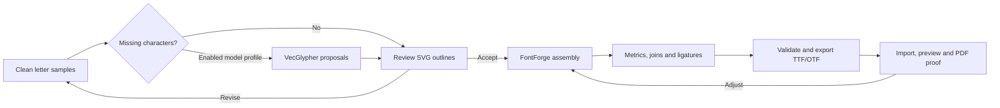

# Calligraphy worksheet studio

The studio at `/calligraphy/practice` makes printable sheets and editable templates for a calligrapher. The starting sheet is US Letter **landscape**, 24 evenly spaced horizontal rules, no example text, and no slants. Existing inscription masters and canonical poem files remain separate.

The dedicated **Hot Goddess Hot Pen** studio is built from `cockpit.html` for
`hotgoddesshotpen.muchadoaboutoneside.com`. It uses the same worksheet engine
and backend, with a separate TanStack/Vite entry that excludes the sculpture and
3D routes. Local development opens `/cockpit.html`. The left navigation opens
paper, Templates, script specimens, letterforms, Words & poems, Make your own
font, photo/AI, At the mixing table, print checks, Knowledge & guides, and the React Flow practice map.
Templates contains both practice presets and saved sheets. Paper size, margins
and spacing, and line appearance have separate subsection selectors.

The desktop **Columns** chooser offers two work bays (tools and paper), three
(with a persistent poem editor), or four (with studio notes). Narrower windows
automatically fit fewer bays; the chosen preference is kept. Phones put the paper
above the selected tools, with editing under Words & poems. Drag a column title
onto another column to move it, or use its arrow buttons or left/right arrow keys.
Drag a divider to resize its neighbors; focusing the divider and pressing left/right
also resizes. Reset column arrangement restores the default order and widths.
The current arrangement lasts for the visit; column preference and light/dark mode
are saved in this browser. Without a saved appearance, the system color preference
supplies the initial theme.
Changing between two and three columns relocates the editor and resets its
caret selection; the draft and Undo history are retained.

The paper bay never exceeds 1,056 px and the sheet keeps its physical aspect
ratio. The canvas fits the viewport; long controls and poems keep their own scroll
area. Clicking the paper opens a nearly full-screen native modal dialog
with preview magnification, Fit sheet, Escape, and focus restoration. Zoom does
not change physical PDF or print dimensions.
Lettering height and width controls include an enlarged specimen shaped by the
selected font, with space around its full ink bounds for swashes and descenders.
The specimen fits its panel and is explicitly labeled as enlarged; the paper
preview remains the source of physical layout. Font gallery specimens scale
with their cards, and character and letterform previews have larger viewing
areas so narrow tool columns remain useful for comparing the letters.
The dedicated studio uses short content reveals for tools and wizard steps,
subtle feedback on script specimens and navigation, and a soft entrance for
paper zoom and assistant dialogs. The lettering toggle reveals the rendered
specimen; it does not demonstrate stroke order. System reduced-motion settings
disable these effects. Editing, column resizing and physical sheet dimensions
update immediately, and motion styles do not apply to print output.
**Focus paper** hides the tool bay; **Restore tools** brings it back. The prominent
wizard uses the same draft and exports. It begins with six purposes: practice,
poem layout, photo sizing, font creation, ink testing and learning. Each route
mounts one question at a time and can return to the path chooser. Workflow
shows the same route in React Flow, links each tool and launches the questions;
its Mermaid download comes from the same step metadata. See
[all path diagrams and the knowledge flow](calligraphy-paths.md).
Knowledge & guides provides searchable, paginated HTML notes and downloadable
source books with rights and provenance. The server separately indexes selected
historical passages; the browser does not load that corpus into JavaScript. Drafts are browser-origin specific: use
a studio backup to move a draft between the main site and the cockpit hostname.
The optional crew copy uses the existing crew host and requires its signed-in
session. Its request allowlist includes the exact HTTPS cockpit origin; the
public cockpit itself never accepts crew identity headers.

The bottom **Studio chat** answers questions using the server's configured Qwen
model and a [curated, attributed knowledge collection](calligraphy-knowledge.md).
The model selector defaults to Qwen 3.5 27B when that is the first registered
model. Chat history stays in the open page; up to six previous messages accompany
each question. The app does not persist chat server-side. Questions and a small
selection of physical sheet settings reach the model; poem text, uploaded font
bytes, photos and private materials notes are not added automatically. Clear
session removes the in-page conversation. Cancel aborts the current request.
When the model is unavailable, the old topic guide is explicitly labelled as a
local library answer.

**Help now** opens guidance for the selected tool and subsection, or the current
step of Wizard quiz mode. The font creator and Requirements wizard also offer
**Help with this step**. Qwen receives bounded descriptions of those controls
alongside the existing sheet settings and conversation. Photo bytes, poem text
and materials notes are not attached to help requests. Help asks for one concrete
action, its purpose and a check before continuing; follow-up buttons request a
simpler explanation, a check or the next action. Back to my work closes guidance
and returns focus to its launcher without applying settings or advancing the
wizard. An unsent chat message stays in its editor when a help button is used.
When Qwen is offline, the same step has clearly labelled local instructions;
they do not switch tools or impersonate a model response.

**Get Qwen’s take** in Studio chat offers reactions for the current tool: check
spacing, choose a script mood, balance letterforms, review a special-word font
pairing, prepare a photo, plan the next glyph, test ink, choose a practice pattern
or check printing. Every tool also offers **Spot one improvement** and **Give me
a 2-minute drill**. After an answer, **More ways to respond** reveals simpler
explanations, a bolder direction, encouragement, checks and the next step. These
controls stay inside the chat's scrolling area, keeping the bottom studio strip
compact. Each click sends one request using the selected model and current web
research choice; opening chat or changing sheet controls does not request
inference. Reaction buttons preserve an unsent message and cannot apply settings.
Offline reactions show specific local guidance instead of a claimed Qwen reply.

Reaction context includes physical guide and lettering settings, plus the accent
font and relative size when special words are configured. The actual special
words, poem text, photo, uploaded font bytes and free-text materials notes are
not sent to the model. Font or ink advice is a suggestion; the chat cannot see
the rendered lettering or inspect a swatch and asks for missing information.

**Web research** adds one Qwen-written query to the configured Brave Search
provider and supplies at most five bounded snippets to Qwen. The answer exposes
only citations selected from actual library/search evidence. No result page URL
is fetched by the app. Search snippets are reference data, never instructions.
This is a short sourced lookup, not an exhaustive literature review. The control
is unavailable when its provider credential has not been configured.

**Suggested settings** and **Requirements wizard** prepare a reviewable proposal
for purpose, experience, paper, orientation, script, font, nib width, required
x-height and minimum margins. Qwen may recommend x-height and inter-row gap;
typed requirements take precedence. The same shared worksheet geometry used by
the preview computes rows and physical dimensions. For broad-edge italic, five
nib widths is a starting convention; pointed-pen sizing does not use that rule.
Explicit script changes use the existing studio guide presets. Formula-only
calculation is also available and is labelled separately. Review the proposed
values, then Apply; Undo restores the previous settings while the proposal is
still the latest change. A changed draft invalidates an older proposal. The poem
is untouched. The settings answer deterministically compares the starting guide
configuration and proposed row counts on the selected paper; Qwen's free-form
fit claims are not displayed.
Exact shaped text fit still runs in the existing preview/export
checks, so the assistant does not promise an optimal or print-ready result.

The assistant's current transport is the existing loopback Ollama service,
separate from the prepared aintnocallerback glyph-round consumer below. The queue
currently has no registered studio-chat workload; no chat job type is invented
or submitted. The deployed studio keeps assistant/photo AI disabled while this
integration is unfinished. The queued replacement still needs an accepted
workload contract, caller registration, retention disclosure and verified job
recovery/cancellation before activation.
`createApp({ calligraphyAssistant: ... })` accepts explicit URL,
model allowlist, search token and test transport overrides. By default chat uses
`WORKSHEET_VISION_URL` and `WORKSHEET_VISION_MODELS`; the built-in model default is
`qwen3.5:27b`. Optional `WORKSHEET_SEARCH_TOKEN` is a Brave Search credential
injected into the server by the operator through a scoped hid-in grant. It is
never sent to the browser or model. This change does not modify the existing
production manifest or broaden its grant. Telpher's existing credential reference
is `telpher/brave-search-api-key`; its availability to another project is not
authorization to reuse it here. Provider setup and queue activation remain
separate deployment prerequisites.

Requests are limited to 40 KB, six history messages, a three-second cooldown,
and 24 assistant requests per server process per hour. Chat and photo analysis
share one model-workload admission slot; a slow chat upload does not occupy it.
The assistant caps serialized messages at 6,980 UTF-8 bytes, reserving space in
the 8,192-token context for chat wrappers and a 700-token answer. Oldest history
is omitted when needed; evidence excerpts are packed within the same bound,
prioritizing a web result during research. The response reports shortened
evidence and omitted older turns. The current question, requirements and system
instructions are retained. A lookup has one search call and at most two model calls, under one
180-second work deadline; uploads have a separate 15-second limit. Unsupported
models, invalid answers, unavailable search, cancellation and limits return
explicit errors without modifying a worksheet. These process-local limits are
appropriate to the single service process; multiple replicas need a shared
admission policy before scaling.

**At the mixing table** includes manufacturer-linked advice on compatible
colour mixing, metallic inks, dilution, gum arabic, and test swatches; save a
physical mixing recipe and observations in Materials notes. A screen cannot
predict the colour or behaviour of a real pigment mixture.

**Make your own font** opens a four-step wizard: upload a sample,
calibrate its physical scale, review bounded letter rounds, and finish the font.
It reuses the same photo and preserves calibration and job state when switching
Reference, Sizing, and Create a font. Registered profiles using Qwen 27 are
preferred by their actual model names when available. If glyph rounds are
disabled, manual sizing and the font-finishing guide remain available. A
reviewed SVG is one letter; assemble approved outlines in FontForge, check
metrics, spacing and joins, validate and export TTF/OTF, then import the finished
font. Calligraphr remains an alternative using its own marked template. The
studio does not launch FontForge, upload photos to Calligraphr, or compile an
installable font itself.

Photo/AI also contains a prepared named-job consumer for bounded Qwen →
VecGlypher → Qwen rounds. It is disabled until operators provide a reviewed,
registered server-only caller configuration to `createApp`'s `worksheetPipeline`
option; the production entry currently supplies none. Profiles fix model roles
and at most three rounds. Submissions retain their idempotency key through
uncertain receipts. Signed job-specific access permits progress, cancellation
and validated results without exposing a caller credential or following returned
URLs. The browser retains the request/access in session storage for up to a day;
automatic visible-page polling ends after thirty minutes, with manual checks
available. Cancellation stops future rounds after an in-flight call returns.
The queue retains prompts, selected photos and outputs in durable history with
no automatic deletion yet; the start controls disclose this before submission.
Only validated inert SVG paths can be previewed or downloaded. Accepted sizing
still requires manual review and low-confidence sizing cannot be applied.

## Delivery and acceptance

- Share one validated physical layout between the preview and vector PDF. Offer plain rules, Copperplate/italic zones, grid, optional slants, paper dimensions, margins, exact spacing, guide appearance, pages and a scale check.
- Keep a separate initially empty Yjs text editor. Load a copy of either poem wording on request, retain manual breaks, estimate wrap/rows/sheets, and provide font, size, color, alignment and width controls.
- Store the draft and named templates locally, synchronize tabs, report storage failures truthfully, and provide versioned digital backups. No publicly shared poem room receives worksheet text or photos. Browser storage works without authentication. An explicitly requested crew copy can be saved to the signed-in Authentik identity through the crew board; it does not silently replace the browser draft or provide live multi-device synchronization.
- Import photos locally, normalize image size, and require a known measurement for physical calibration. A photo is a reference, not OCR or automatic identification of a handwriting font. Reference printing is an explicit choice.
- Ordinary PDFs contain only selected visible content. Editable-PDF export explicitly includes a recognized template attachment; raw reference photos and uploaded font files are omitted from that attachment. Digital backups can contain these assets. Arbitrary third-party PDFs are not editable studio templates.
- Include techniques for underlays, light pads/windows, opaque-paper graphite transfer, pencil ruling and materials testing. Distinguish animal vellum from translucent drafting paper and vellum surface finishes.
- Verify generated geometry, font/text layout, persistence, template round trips, PDF structure, production HTTP, and browser interactions within approved computer-control scope. Open a canonical PR, pass CI and review, publish the sanitized public snapshot, then stage and deploy the exact reviewed release with a recorded rollback target.

## Dependencies and references

Existing Yjs, CodeMirror and browser storage supply editing and persistence. `pdf-lib@1.17.1` and `@pdf-lib/fontkit@1.1.1` provide font embedding, vector PDFs, and template attachments behind a lazy adapter. Both are MIT licensed and have old release dates; isolate PDF parsing, bound imports and keep digital JSON as the stable editable format. Do not execute imported PDF content.

## Fonts and physical lettering

The curated collection includes Great Vibes, Pinyon Script, Imperial Script,
Italianno, Herr Von Muellerhoff, and Mrs Saint Delafield. These are lettering
and design references; a decorative typeface does not teach Copperplate stroke
order or pressure. Keep dedicated hand-authored exercises and historical
exemplars distinct from font samples.

The font gallery loads three small Latin-only Fontsource WOFF2 specimens initially
and all six when opened. Worksheets use the complete, pinned Google Fonts TTFs, because the
small gallery subsets omit some alternate letters and stylistic features.
The same shaped outlines supply the worksheet preview and PDF for bundled and
uploaded fonts, including when HarfBuzz is selected. Outlined lettering stays
vector-sharp but is not ordinary selectable PDF text; the standard reference
serif, sans, and mono fonts retain a text fallback. Editable worksheet
attachments retain the original text.

The writing panel's **Special words** control gives up to eight names or phrases
one separate bundled script and a relative size from 50% to 200%. Enter one
phrase per line; matching is case-sensitive and uses complete words, so “Ann”
does not style “Anna”. Every matching occurrence receives the treatment.
The small specimen previews the selected script; **Apply special lettering**
updates the physical sheet. **Use main font for all words** removes the treatment.
These controls preserve the poem's text and save with drafts, named templates,
JSON backups and editable PDFs. The layout keeps matching phrases together and
reports when they are too wide. Emergency splitting of long words is disabled
while special lettering is active, preserving complete-word matching after
wrapping. Flourishes still participate in ink-bound and
row-collision checks. SVG preview and PDF export use the same mixed-font runs.
Special lettering currently supports left-to-right lines and the six bundled
scripts, with each script's default OpenType features. Main-font alternate
controls continue to apply to surrounding words. Separate per-occurrence styles
and multiple uploaded accent fonts are not provided.

Point sizing remains the default for existing templates. Lowercase-height mode
uses the font's x-height to calculate the point size for a physical measurement
in millimeters; the guide-matching action copies the worksheet guide height.
When font metadata is missing, an outline-derived height is an estimate.
Only features advertised by the selected full font appear in the alternate
letter controls. Feature overrides, shaping engine, lowercase height, and
practice pattern are saved with the draft and portable templates.

The height and width sliders update physical lettering dimensions and the same
outlines used for PDFs. Printer paper is the default screen surface; the vellum
switch gives the preview a translucent warm tint without adding a printed background.
After calibrating a known length, optional photo analysis sends a prepared image
to the configured vision model on presvd1 only when explicitly requested. Review
the estimated x-height, baseline spacing and lowercase letter width before applying
them to plain practice rows. Low-confidence suggestions require manual measurement
or a clearer photo. Existing text is preserved, and manual calibration works when
the model service is unavailable.

Photo sizing defaults to Qwen 3.5 27B; the selector shows only the operator's
installed vision-model allowlist. Measurements are estimates, even when the
model reports high confidence. Confirm the baseline spacing against the photo
before applying. Analysis can take up to three minutes and can be cancelled.
Loading a different poem version or a fitting excerpt asks before replacing
existing worksheet words. Cancel keeps the current words and selected version;
confirmed replacements form one text-undo action.
Starting analysis focuses Cancel; cancelling returns to Analyze photo. A failed
Apply keeps the suggestion and returns to its Apply control so the draft can be
reviewed and the action retried.

“Make your handwriting a font” sits beside the visual font gallery and in the
wizard's lettering step. Its primary guide is clean samples → reviewed SVGs →
FontForge → TTF/OTF. [VecGlypher](https://github.com/xk-huang/VecGlypher) supports
reference glyph images plus a target character; missing letters are proposals
to compare with the originals, not automatically accepted alphabet completions.
The studio's registered profile must be enabled before its rounds are available.

In [FontForge](https://fontforge.org/docs/tutorial/importexample.html), import
each approved SVG into the intended character slot and align baseline,
lowercase height, side bearings and advance width. Proof words, repeated
letters, punctuation and a short poem. Cursive needs consistent joins plus
ligatures or variants where a combination needs a different shape. Use
[Generate Fonts](https://fontforge.org/docs/ui/dialogs/generate.html) with
validation, export TTF/OTF, and import it into the studio. Check the supported
feature controls and compare the preview with the exported PDF at the intended
print size. The guide describes manual assembly in the external application;
there is no automatic alphabet export or FontForge invocation.

The alternative [Calligraphr workflow](https://www.calligraphr.com/en/docs/tutorial1/)
uses its marked character template: fill the cells, capture all four corner
markers, upload in Calligraphr, review spacing, then build TTF/OTF. Character
variants are available; ligatures require its Pro plan. The studio does not
upload photos there or treat an arbitrary practice sheet as that template.

The model/trace/blank pattern reserves three writing rows per line of text:
one model, one faint tracing copy, and one blank practice row. Page estimates
include those rows. Ink-bound checks include flourishes, ascenders, descenders,
and horizontal width scaling; text that would leave the paper blocks export.
Overlapping neighboring rows are reported separately so the writer can adjust
spacing. The comparison download uses a common lowercase height across fonts
and does not replace the current worksheet draft.

Fontkit is the default shaper. HarfBuzz.js 1.6.1, containing HarfBuzz 14.4.0,
loads only when selected. The full TTFs, gallery subsets, and WASM come from
the same site, with no runtime font CDN requests. Exact source revisions and
hashes are in `public/fonts/worksheet-fonts.provenance.json`. The security
review, advisory scope, and remaining parser limitations are recorded in
[the font security review](calligraphy-font-security.md).

`bun run verify:worksheet-fonts` checks font provenance and dependency pins.
`bun run build` checks the manifest for lazy loading, six small WOFF2 previews,
one core WASM, absence of the unused HarfBuzz subsetter and production source
maps, and a 340,000-byte gzip budget for the cockpit's initial JavaScript graph.
Synchronous text layout stays available to the paper preview; PDF creation,
comparison and import load on demand and are excluded from the initial bundle.
The interactive workflow renderer loads when Workflow opens; the path buttons
and Mermaid export remain available while it loads or if that request fails.
`bun run test:studio-dom` mounts the assistant, workflow and special-word controls
in an isolated Happy DOM test process. It checks applying/removing special
lettering, contextual help, draft preservation,
cancellation and focus restoration, plus usable path controls after successful
or failed map loading. This runs inside `bun run check`; it does not replace
real browser checks of layout, keyboard behavior or animation.
Typing keeps the measured preview deferred, and unchanged sheet previews are
memoized so unrelated control updates do not rebuild their SVG trees. The
server supplies the correct WOFF2 and WASM MIME types.

Bickham Script is not bundled: a public tool where visitors apply a font to
their own text needs an appropriate generator license. An Adobe Fonts
subscription alone does not cover that use; see [Adobe's licensing FAQ](https://helpx.adobe.com/fonts/web/font-licensing/font-licensing.html).
No paid font files or licenses are purchased by this release.

- [pdf-lib document API](https://pdf-lib.js.org/docs/api/classes/pdfdocument)
- [pdf-lib attachment extraction discussion](https://github.com/Hopding/pdf-lib/issues/534)
- [CSS paged media](https://www.w3.org/TR/css-page-3/)
- [Logos Calligraphy guides](https://s3.amazonaws.com/kajabi-storefronts-production/file-uploads/sites/94612/themes/1600613/downloads/48010e4-c054-2f2a-6f7b-ad8a2484ea8_Copperplate_Guidesheet_Packet.pdf)
- [Canson translucent vellum](https://us.canson.com/artist-series-vidalon-vellum)
- [The Postman’s Knock: light boxes](https://thepostmansknock.com/need-light-box-includes-giveaway/)
- [Alvalyn Creative: graphite transfer](https://alvalyn.com/how-to-use-graphite-paper-to-transfer-drawings/)

Browser storage can be cleared or evicted. Saving a portable backup remains the durable way to carry the full editable studio between browsers or devices. A crew copy stores the current worksheet snapshot for the signed-in identity. Physical printing still requires a ruler check at 100% scale.
